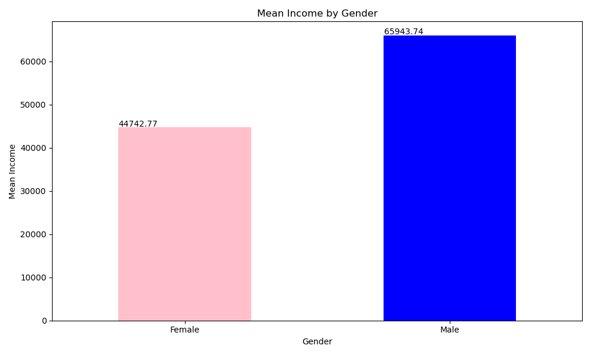
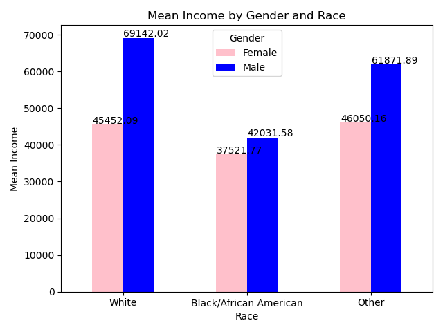

# IDS_DE Pandas Assignment by Jay Liu

This repository contains my work for the Pandas Descriptive Statistics Script assignment in IDS 706. The script reads a dataset, generates summary statistics, and creates data visualizations. To use it, simply link it to a GitHub Codespace and wait for the devcontainer to run the Makefile, which will execute the following tasks: install, format, lint, and test.

## Repository Components

This repository includes the following components:

- `.devcontainer`: Devcontainer configuration for setting up the development environment in Codespaces.
- `Makefile`: Contains commands for installing dependencies, formatting code, running linters, and testing.
- `requirements.txt`: Lists all the Python packages required for running the script.
- `README.md`: This documentation file.
- `.githubactions`: Configuration for GitHub Actions to automate CI tasks.
- `Dockerfile`: Defines the Docker environment to ensure consistent development setup.

## Purpose

The purpose of this project is to create a Python script that performs descriptive statistics on a given dataset using Pandas. The script:
1. Reads a dataset (CSV file).
2. Filters and processes data to focus on key variables such as age, sex, race, and income.
3. Generates important summary statistics such as mean, median, and standard deviation.
4. Recodes categorical variables and creates dummy variables.
5. Creates bar charts to visualize the mean income by gender and by race.

The project uses `matplotlib` and `seaborn` for data visualization and produces a clear summary of the dataset through both textual and graphical outputs.

## Setup and Preparation

1. Open GitHub Codespaces.
2. Load the repository into Codespaces.
3. Wait for the installation of all dependencies specified in `requirements.txt`.
4. Run the following command to execute the Makefile:
Repository Components
This repository includes the following components:

## About the Dataset

The dataset used in this project is based on survey data from the **Integrated Public Use Microdata Series (IPUMS)**, affiliated with the University of Minnesota (2019). The dataset contains demographic and wage information for individuals aged between 18 and 65. It captures various attributes including sex, age, race, and income from wages.

### Variables:
1. **Sex**: 1 represents male, 2 represents female.
2. **Age**: Represents the actual age of the individual.
3. **Race**: Categorized as:
- 1 = White
- 2 = Black/African American
- 3 = Other (including Asian, American Indian, and mixed races)
4. **Income (INCWAGE)**: Annual income in USD, with missing or retired individuals excluded.

The script filters out individuals with no reported income and focuses on individuals of working age (18-65).

## Outputs

### 1. **Summary Report**
The script calculates and displays summary statistics for numerical variables like age, income, and race proportions. The statistics include mean, standard deviation, minimum, and maximum values for different demographic groups.

### 2. **Visualizations**
The script generates two key visualizations:
- **Mean Income by Gender**: A bar chart that displays the average income for males and females.
- **Mean Income by Gender and Race**: A grouped bar chart showing the mean income for different races, split by gender.

## Example Output

### Summary Statistics:

|       | Male | White | Black | Other_Races | INCWAGE | AGE   |
|-------|------|-------|-------|-------------|---------|-------|
| mean  | 0.52 | 0.77  | 0.09  | 0.14        | 55650.02| 41.42 |
| std   | 0.50 | 0.42  | 0.29  | 0.09        | 67463.87| 13.60 |
| min   | 0.00 | 0.00  | 0.00  | 0.00        | 5000.00 | 18.00 |
| max   | 1.00 | 1.00  | 1.00  | 1.00        | 250000.0| 65.00 |

### Visualizations:

1. **Mean Income by Gender**:

2. **Mean Income by Gender and Race**:
